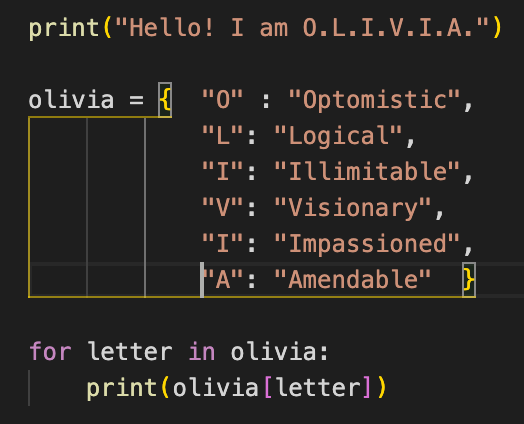

### Hi there, nice to meet you!

  <em><strong>Hi! I'm Livy!</strong></em> I recently completed the Full Stack Web Development track at Lambda School and have a passion for design.

### 🌱 I’m currently working on:
- Working with a team to build an education game for kids in elementary school. <a href="https://www.storysquad.education/">Story Squad</a>
- Studying at <a href="https://lambdaschool.com/">Lambda School</a>

### 💻 Programming Languages & Tools:
- ⌨️ Python 
- 🛠 Node | Express Framework
- 🌐 JavaScript | React | Redux | HTML | CSS | Styled-Components | Bootstrap | Ant Design
- 🛢 PostgreSQL | SQLite3
- 🌎 Heroku | Vercel | Netlify
- ⚙️ Git | GitHub 
- 🔧 VS Code | Postman
- 🖥 Whimsical | Figma

---
